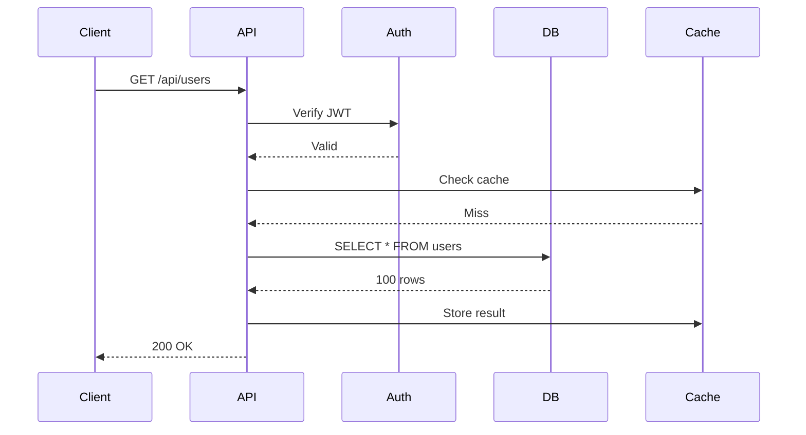

# Request Flow Visualization

Visualize request execution flow with waterfall charts, timeline views, and Mermaid diagrams. Understand exactly how your requests execute and where time is spent.

## Table of Contents

1. [Overview](#overview)
2. [Flow Tracking](#flow-tracking)
3. [Waterfall Charts](#waterfall-charts)
4. [Mermaid Diagrams](#mermaid-diagrams)
5. [API Endpoints](#api-endpoints)
6. [Integration](#integration)

---

## Overview

Flow visualization shows the complete execution timeline of a request, including:
- HTTP request/response
- Middleware execution
- Database queries
- External API calls
- Custom operations

### Example Flow

```
Request Start                                          Response End
    |                                                        |
    |--[Auth]--|--[Validation]--|--[DB Query]--|--[Response]|
       5ms          10ms             50ms           5ms
```

---

## Flow Tracking

### Automatic Tracking

RamAPI automatically tracks request flow when observability is enabled:

```typescript
const app = createApp({
  observability: {
    tracing: {
      enabled: true,
      serviceName: 'my-api',
    },
  },
});

// Flows are automatically tracked
app.get('/api/users', async (ctx) => {
  ctx.json({ users: [] });
});
```

### Accessing Flow Data

```typescript
import { getFlowData } from 'ramapi';

app.get('/debug/flow/:traceId', async (ctx) => {
  const flowData = await getFlowData(ctx.params.traceId);
  ctx.json(flowData);
});
```

---

## Waterfall Charts

### What is a Waterfall Chart?

A waterfall chart shows operations stacked vertically by time:

```
|------------- Request Duration: 150ms -------------|
|
|-- Auth (5ms)
|    |-- JWT Verify (4ms)
|
|-- Validation (10ms)
|
|-- Handler (120ms)
     |-- DB Query Users (50ms)
     |-- DB Query Posts (40ms)
     |-- Format Response (30ms)
|
|-- Response (15ms)
```

### Generating Waterfall Data

```typescript
app.get('/debug/waterfall/:traceId', async (ctx) => {
  const flowData = await getFlowData(ctx.params.traceId);

  const waterfall = {
    traceId: flowData.traceId,
    duration: flowData.duration,
    operations: flowData.spans.map(span => ({
      name: span.name,
      start: span.startTime,
      duration: span.duration,
      depth: span.depth,
    })),
  };

  ctx.json(waterfall);
});
```

### Visualizing in Browser

```html
<!DOCTYPE html>
<html>
<head>
  <title>Request Waterfall</title>
  <style>
    .waterfall { margin: 20px; }
    .operation {
      margin-left: var(--depth);
      background: #3b82f6;
      color: white;
      padding: 5px;
      margin-bottom: 2px;
      width: var(--width);
    }
  </style>
</head>
<body>
  <div id="waterfall"></div>

  <script>
    fetch('/debug/waterfall/3f2504e04f8911edb13900505634b5f1')
      .then(r => r.json())
      .then(data => {
        const container = document.getElementById('waterfall');

        data.operations.forEach(op => {
          const div = document.createElement('div');
          div.className = 'operation';
          div.style.setProperty('--width', `${(op.duration / data.duration) * 100}%`);
          div.style.setProperty('--depth', `${op.depth * 20}px`);
          div.textContent = `${op.name} (${op.duration.toFixed(2)}ms)`;
          container.appendChild(div);
        });
      });
  </script>
</body>
</html>
```

---

## Mermaid Diagrams

### Generating Mermaid Diagrams

```typescript
import { generateMermaidDiagram } from 'ramapi';

app.get('/debug/mermaid/:traceId', async (ctx) => {
  const flowData = await getFlowData(ctx.params.traceId);
  const mermaidCode = generateMermaidDiagram(flowData);

  ctx.text(mermaidCode);
});
```

### Example Mermaid Output



### Rendering Mermaid in Browser

```html
<!DOCTYPE html>
<html>
<head>
  <title>Request Flow</title>
  <script src="https://cdn.jsdelivr.net/npm/mermaid/dist/mermaid.min.js"></script>
</head>
<body>
  <div class="mermaid">
    <!-- Mermaid diagram here -->
  </div>

  <script>
    fetch('/debug/mermaid/3f2504e04f8911edb13900505634b5f1')
      .then(r => r.text())
      .then(diagram => {
        document.querySelector('.mermaid').textContent = diagram;
        mermaid.init();
      });
  </script>
</body>
</html>
```

---

## API Endpoints

### Debug Endpoints

Create debug endpoints to access flow data:

```typescript
// Get flow data by trace ID
app.get('/debug/flow/:traceId', async (ctx) => {
  const flowData = await getFlowData(ctx.params.traceId);
  ctx.json(flowData);
});

// Get recent flows
app.get('/debug/flows', async (ctx) => {
  const flows = await getRecentFlows({ limit: 10 });
  ctx.json({ flows });
});

// Get slow flows
app.get('/debug/flows/slow', async (ctx) => {
  const flows = await getRecentFlows({
    slowOnly: true,
    threshold: 1000, // >1s
  });
  ctx.json({ flows });
});

// Get waterfall data
app.get('/debug/waterfall/:traceId', async (ctx) => {
  const flowData = await getFlowData(ctx.params.traceId);
  const waterfall = formatWaterfall(flowData);
  ctx.json(waterfall);
});

// Get Mermaid diagram
app.get('/debug/mermaid/:traceId', async (ctx) => {
  const flowData = await getFlowData(ctx.params.traceId);
  const mermaid = generateMermaidDiagram(flowData);
  ctx.text(mermaid);
});
```

### Flow Data Structure

```typescript
interface FlowData {
  traceId: string;
  spanId: string;
  duration: number;
  protocol: 'rest' | 'graphql' | 'grpc';
  operationName: string;
  startTime: number;
  endTime: number;
  spans: Span[];
}

interface Span {
  name: string;
  startTime: number;
  duration: number;
  depth: number;
  attributes: Record<string, any>;
}
```

---

## Integration

### Complete Debug Dashboard

```typescript
import { createApp } from 'ramapi';
import { getFlowData, getRecentFlows, generateMermaidDiagram } from 'ramapi';

const app = createApp({
  observability: {
    tracing: {
      enabled: true,
      serviceName: 'my-api',
    },
  },
});

// Debug routes
app.group('/debug', (router) => {
  // Get specific flow
  router.get('/flow/:traceId', async (ctx) => {
    const flowData = await getFlowData(ctx.params.traceId);
    ctx.json(flowData);
  });

  // List recent flows
  router.get('/flows', async (ctx) => {
    const { limit = 10, slowOnly = false } = ctx.query;

    const flows = await getRecentFlows({
      limit: parseInt(limit as string),
      slowOnly: slowOnly === 'true',
    });

    ctx.json({ flows });
  });

  // Get waterfall
  router.get('/waterfall/:traceId', async (ctx) => {
    const flowData = await getFlowData(ctx.params.traceId);

    const waterfall = {
      traceId: flowData.traceId,
      duration: flowData.duration,
      operations: flowData.spans.map(span => ({
        name: span.name,
        start: span.startTime - flowData.startTime,
        duration: span.duration,
        depth: span.depth,
      })),
    };

    ctx.json(waterfall);
  });

  // Get Mermaid diagram
  router.get('/mermaid/:traceId', async (ctx) => {
    const flowData = await getFlowData(ctx.params.traceId);
    const mermaid = generateMermaidDiagram(flowData);
    ctx.text(mermaid);
  });

  // Dashboard HTML
  router.get('/dashboard', async (ctx) => {
    ctx.html(`
      <!DOCTYPE html>
      <html>
        <head>
          <title>Flow Dashboard</title>
          <script src="https://cdn.jsdelivr.net/npm/mermaid/dist/mermaid.min.js"></script>
          <style>
            body { font-family: sans-serif; margin: 20px; }
            .flow { border: 1px solid #ccc; padding: 10px; margin-bottom: 10px; }
          </style>
        </head>
        <body>
          <h1>Request Flows</h1>
          <div id="flows"></div>

          <script>
            fetch('/debug/flows')
              .then(r => r.json())
              .then(data => {
                const container = document.getElementById('flows');

                data.flows.forEach(flow => {
                  const div = document.createElement('div');
                  div.className = 'flow';
                  div.innerHTML = \`
                    <h3>\${flow.operationName}</h3>
                    <p>Trace ID: \${flow.traceId}</p>
                    <p>Duration: \${flow.duration.toFixed(2)}ms</p>
                    <a href="/debug/waterfall/\${flow.traceId}">Waterfall</a> |
                    <a href="/debug/mermaid/\${flow.traceId}">Mermaid</a>
                  \`;
                  container.appendChild(div);
                });
              });
          </script>
        </body>
      </html>
    `);
  });
});

app.listen(3000);
```

Access dashboard at: http://localhost:3000/debug/dashboard

---

## Next Steps

- [Performance Profiling](profiling.md)
- [Distributed Tracing](tracing.md)
- [Monitoring Integration](monitoring-integration.md)

---

**Need help?** Check the [Troubleshooting Guide](../guides/troubleshooting.md) or [GitHub Issues](https://github.com/yourusername/ramapi/issues).
